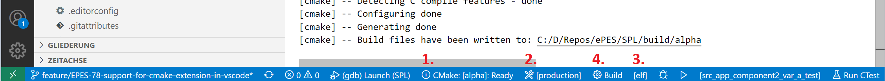
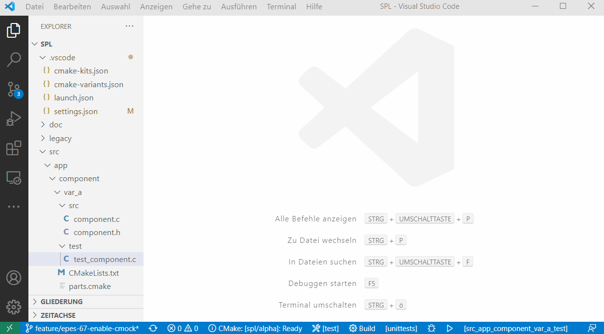

# Build Binaries

We assume you want to build variant **alpha**.

## Visual Studio Code

In the blue ribbon at the bottom (1) select a variant like _alpha_, (2) and the Kit _prod_ ,(3) choose the build target _exe_, _default_ or _all_ and (4) click on build:




## Command Line

The following shows the steps/commands when you use Windows PowerShell to do so.

```powershell
cd <Your root directory of repository>

.\build.ps1 -build -target exe
```

## Binary Location

After the build all binaries can be found under `/build/{variant}/prod`.